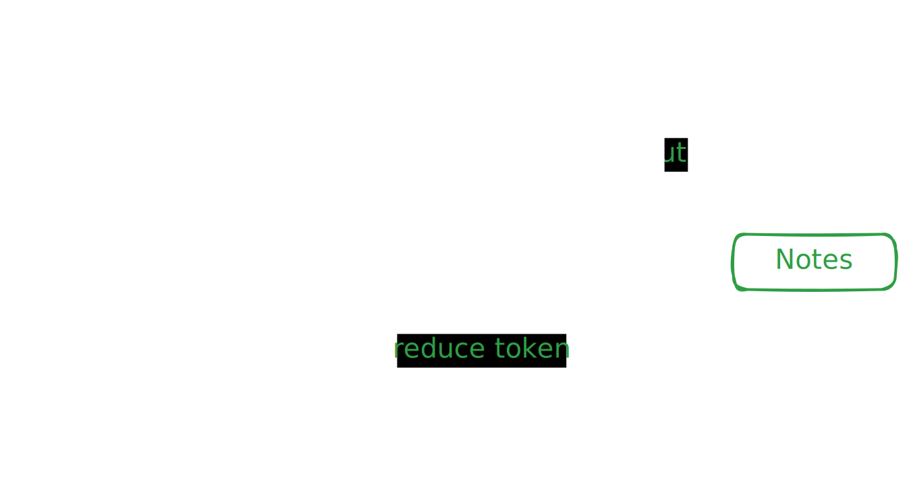

# Lecture Video to LaTeX Notes Processor

A comprehensive Python project that extracts audio from lecture videos, transcribes the content, processes the text, and generates structured LaTeX notes using AI.

## Features

- **Audio Extraction**: Extract audio from video files using FFmpeg
- **Whisper Transcription**: Convert audio to text using OpenAI's Whisper model (much more accurate than traditional speech recognition)
- **Text Processing**: Clean transcripts and remove filler words/stop words
- **LaTeX Generation**: Create formatted academic notes using LLM

## Installation

1. **Install FFmpeg** (required for audio extraction):

   - Windows: Download from https://ffmpeg.org/download.html
   - macOS: `brew install ffmpeg`
   - Linux: `sudo apt-get install ffmpeg` (Ubuntu/Debian)

2. **Install Python dependencies**:

   ```bash
   # Install uv globally
   curl -LsSf https://astral.sh/uv/install.sh | sh
   uv venv
   source .venv/bin/activate  # Linux/macOS
   .venv\Scripts\activate     # Windows
   uv pip install .
   ```

3. **Note**: Whisper will automatically download the required model on first usage. Model sizes:
   - `tiny`: Fastest, least accurate (~39 MB)
   - `base`: Good balance (default) (~74 MB)
   - `small`: Better accuracy (~244 MB)
   - `medium`: High accuracy (~769 MB)
   - `large`: Best accuracy but slower (~1550 MB)

## Usage

Edit the `.env` file with your configuration:

```
# Required for Deepseek API access
DEEPSEEK_API_KEY=your_api_key_here
```

### Command Line Interface

```bash
python main.py path/to/lecture_video.mp4 [options]
```

**Options:**

- `-o, --output`: Output directory (default: "output")
- `-k, --keep-intermediates`: Keep intermediate files (audio, subtitles)
- `--whisper-model`: Whisper model size (tiny/base/small/medium/large)
- `--language`: Language code (e.g., 'en', 'es', 'fr') for better accuracy

**Examples:**

```bash
# Basic usage with default settings
python main.py lecture.mp4

# High accuracy transcription with Spanish language
python main.py lecture_spanish.mp4 --whisper-model large --language es

# Full featured with API key
python main.py lecture.mp4 -o my_notes --whisper-model medium
```

### Python API

```python
from lecture_processor.main import LectureProcessor

# Initialize processor with Whisper model
processor = LectureProcessor(
    api_key="your_openai_key",
    whisper_model="medium"  # Choose model size
)

# Process lecture video
latex_file = processor.process_lecture(
    "path/to/video.mp4",
    output_dir="output",
    keep_intermediates=False,
    language="en"  # Optional: specify language
)

print(f"Notes generated: {latex_file}")
```

## Project Structure

Below is a visual representation of the project's workflow:


## How It Works

1. **Audio Extraction**: Uses FFmpeg to extract high-quality audio from video files
2. **Whisper Transcription**: Uses OpenAI's Whisper model for highly accurate speech-to-text conversion with automatic:
   - Language detection (or you can specify)
   - Punctuation and capitalization
   - Speaker diarization (basic)
   - Noise handling
3. **Text Processing**:
   - Removes filler words (um, uh, etc.)
   - Eliminates stop words
   - Creates paragraph structure
   - Cleans transcription errors
4. **LaTeX Generation**: Uses OpenAI's API to create structured academic notes
